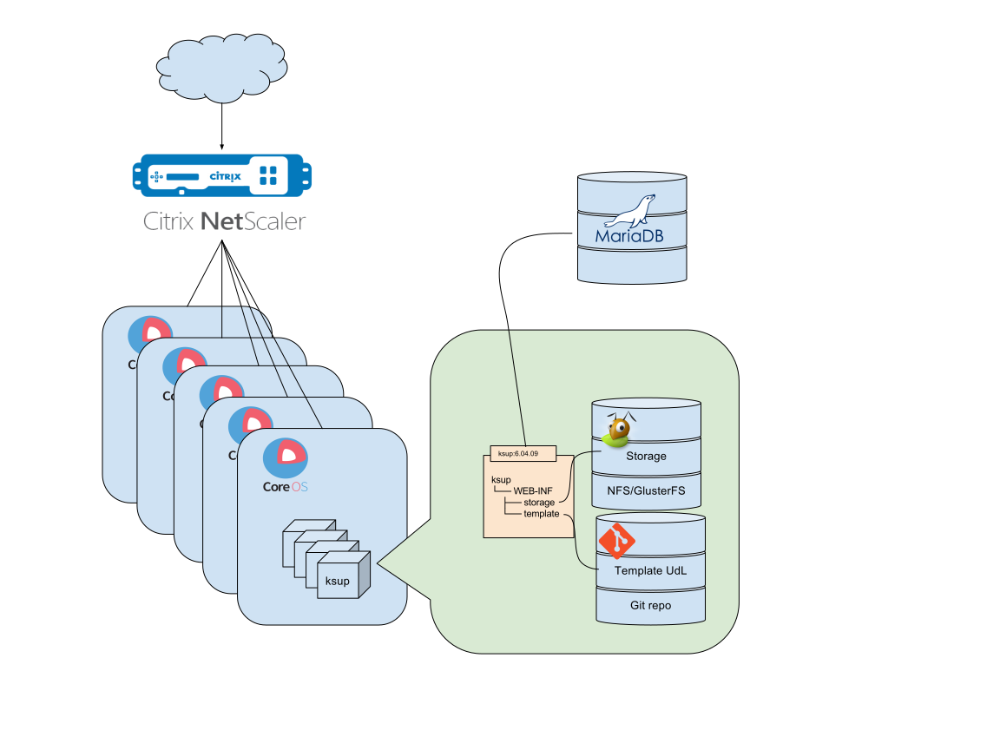

#Recommandations Techniques

##Installation docker

La solution sera hébergée sur un cluster CoreOs chargé d'exécuter des containers docker.

exemple de container:

[v20100/docker-ksup](https://github.com/zzOzz/docker-ksup)

Le site web sera distribué par un reverse-proxy Netscaler.

Chaque hôte CoreOs distribue les applications web à l'aide d'un container nginx

 [v20100/nginx-proxy](https://github.com/zzOzz/nginx-proxy)

##Fonctionnalités KSUP
* Authentification Annuaire & CAS
* Connexion Active Directory
* Récupération des groupes

* Netscaler SSL -> HTTPS
## Schéma d'architecture

##Process de mise à jour

Celle-ci doit être la plus simple possible avec la récupération de l'image de la nouvelle version.

~~~
docker pull ksup:6.04.10
docker-compose up --force-recreate
~~~

Les données (Storage) sont conservées, car stockés sur un volume externe.

La customisation graphique (template) est elle aussi conservée car stocké sur un volume externe versionné sur un dépôt git.
